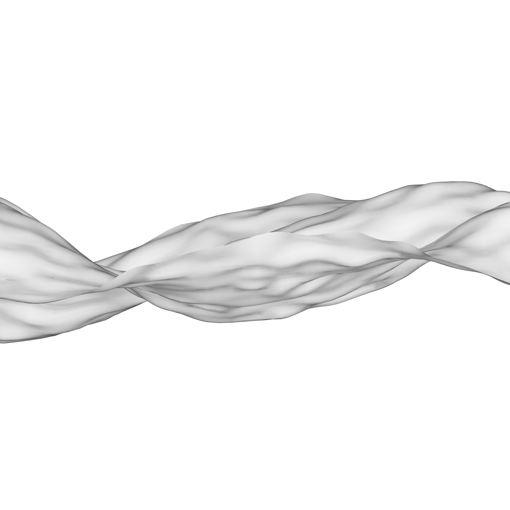
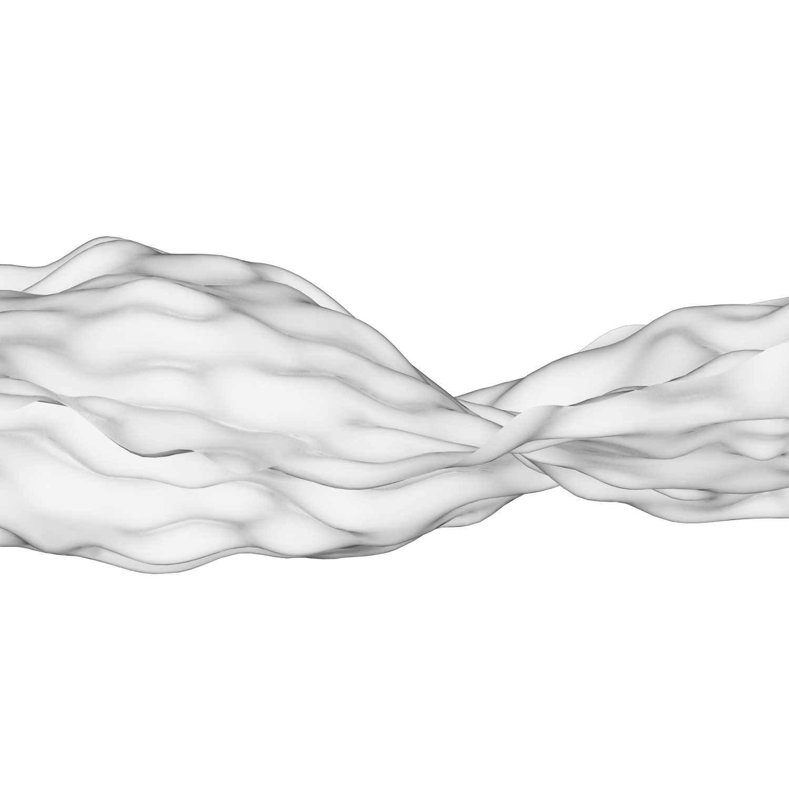

[:material-arrow-left-bold: project list](../../index.md){ .md-button }  
 

>date: 2015  

## 1. Firecracker
{width=600}  
reference: [#317 Firecracker - Project Euler](https://projecteuler.net/problem=317)

## 2. Lightning
{width=800}

## 3. Diffusion-limited aggregation (DLA)
<iframe width="600" height="337" src="https://www.youtube.com/embed/8Rn55JS5URk?si=vvyoW1VZTD45Oziz" title="YouTube video player" frameborder="0" allow="accelerometer; autoplay; clipboard-write; encrypted-media; gyroscope; picture-in-picture; web-share" referrerpolicy="strict-origin-when-cross-origin" allowfullscreen></iframe>

## 4. Rotating Bubbles
{width=600}

## 5. Simplex Noise - Surface
{width=300}
{width=300}
{width=300}
{width=300}
{width=300}

## 6. Dome Structure Deformation
<iframe width="600" height="337" src="https://www.youtube.com/embed/pADqZA-3W-A?si=zOTbQ4NraBW9VHUY" title="YouTube video player" frameborder="0" allow="accelerometer; autoplay; clipboard-write; encrypted-media; gyroscope; picture-in-picture; web-share" referrerpolicy="strict-origin-when-cross-origin" allowfullscreen></iframe>

## 7. Triangle Game
<iframe width="600" height="337" src="https://www.youtube.com/embed/BwyDnvo7KBw?si=ch3umcyHjMf0Xwwb" title="YouTube video player" frameborder="0" allow="accelerometer; autoplay; clipboard-write; encrypted-media; gyroscope; picture-in-picture; web-share" referrerpolicy="strict-origin-when-cross-origin" allowfullscreen></iframe>

## 8. Circle Stacking
<iframe width="600" height="337" src="https://www.youtube.com/embed/vfp88zddyqs?si=OPTJPew-WLzZ7Am5" title="YouTube video player" frameborder="0" allow="accelerometer; autoplay; clipboard-write; encrypted-media; gyroscope; picture-in-picture; web-share" referrerpolicy="strict-origin-when-cross-origin" allowfullscreen></iframe>

## 9. Heighway Dragon
<iframe width="600" height="337" src="https://www.youtube.com/embed/cHxB2tBE4zw?si=BqHloYY1rka9U38m" title="YouTube video player" frameborder="0" allow="accelerometer; autoplay; clipboard-write; encrypted-media; gyroscope; picture-in-picture; web-share" referrerpolicy="strict-origin-when-cross-origin" allowfullscreen></iframe>

[:material-arrow-left-bold: project list](../../index.md){ .md-button }
