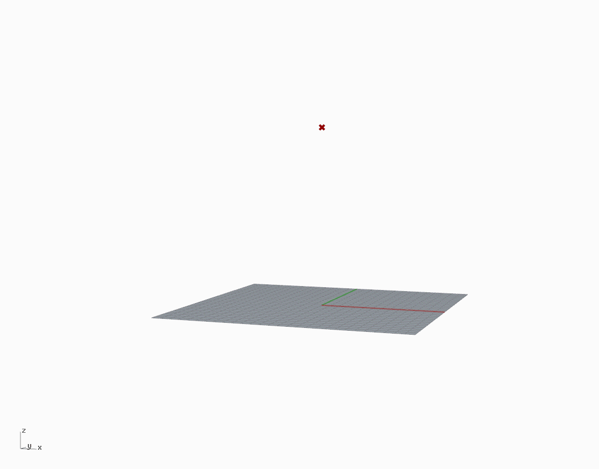
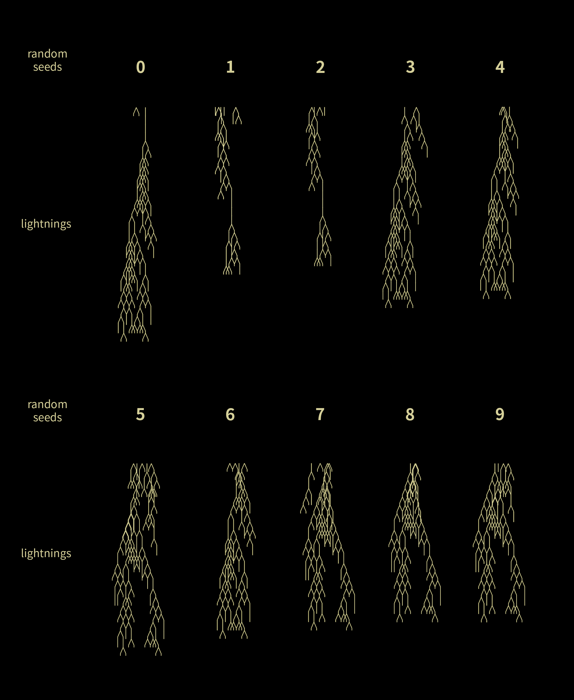
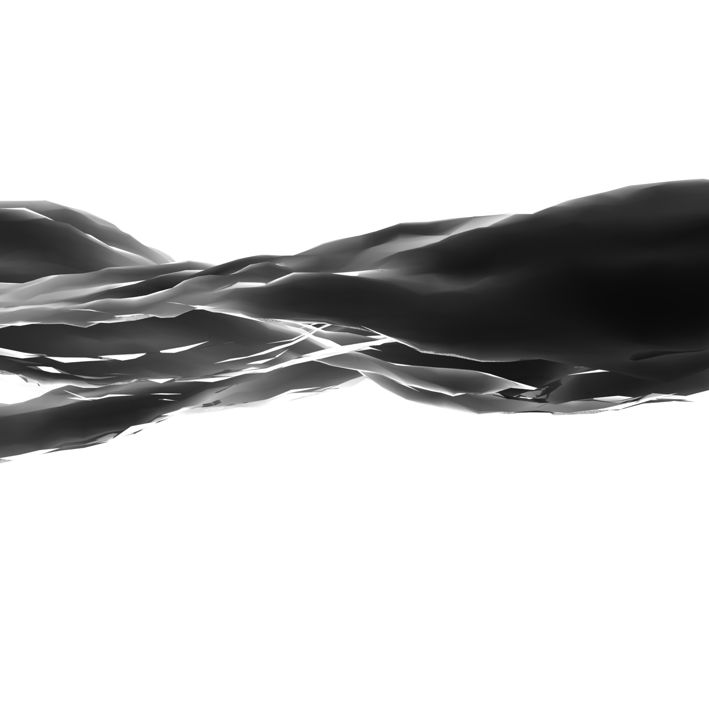
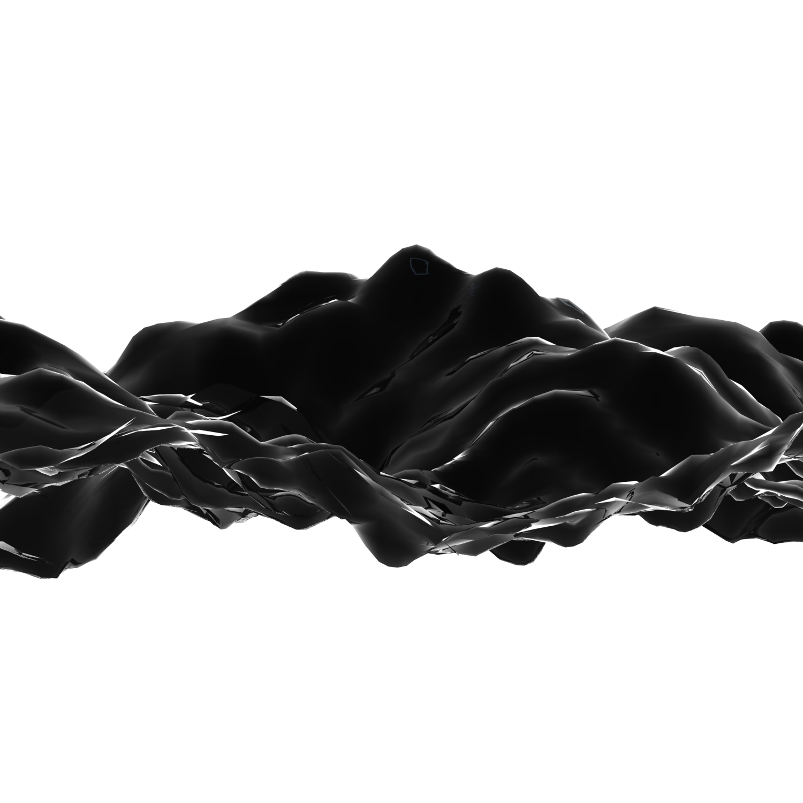
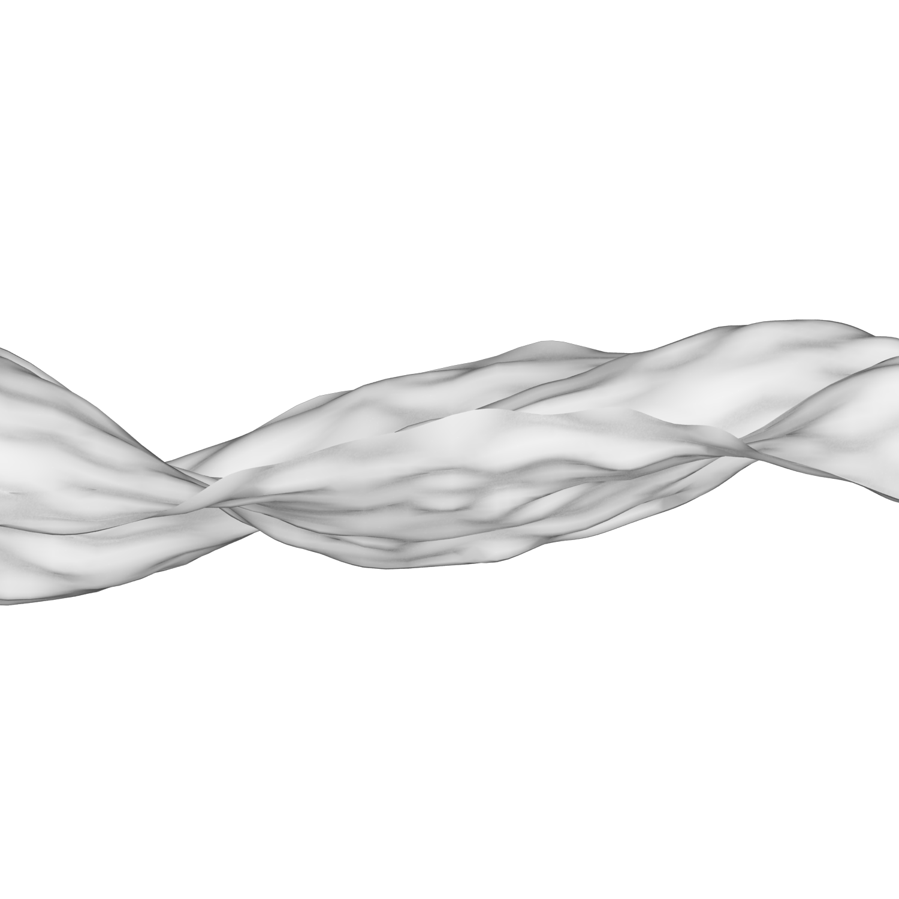
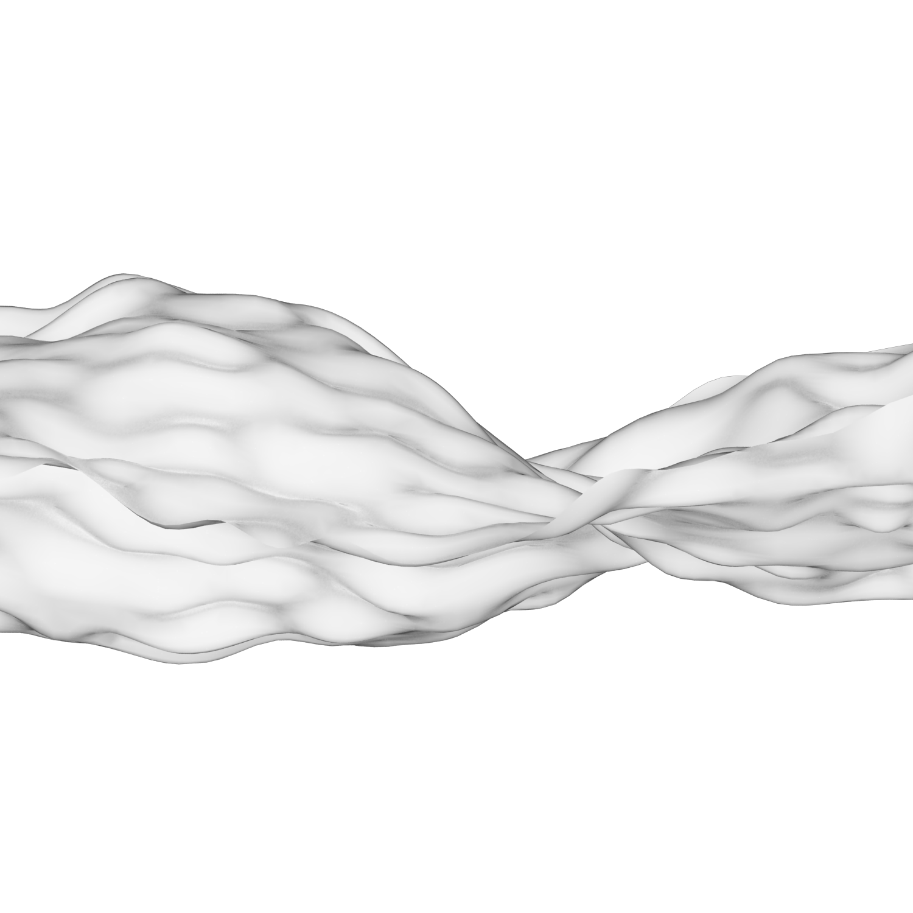
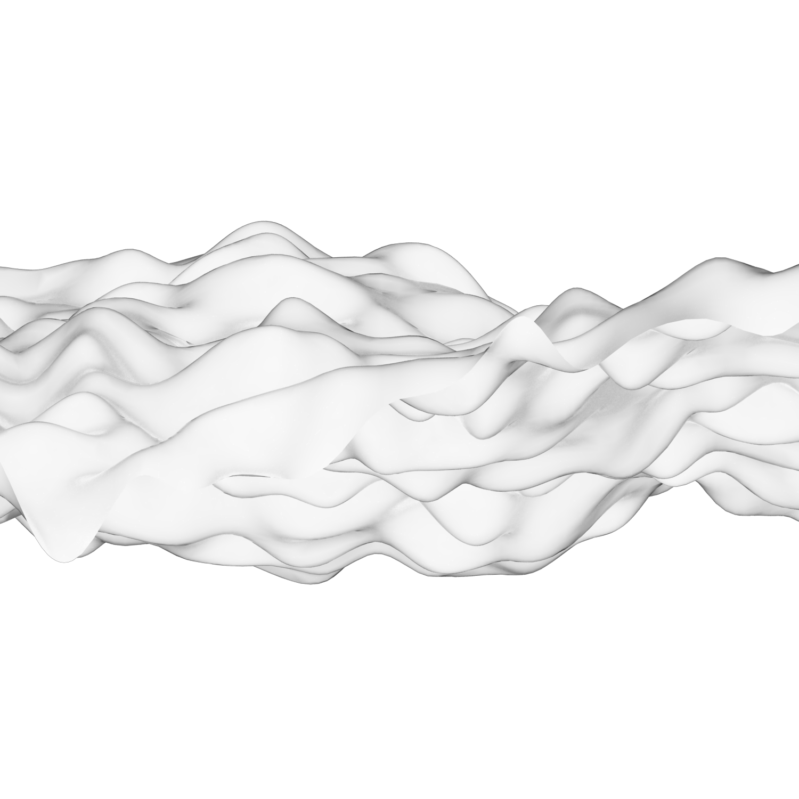

[:material-arrow-left-bold: 프로젝트 목록](../../index.md){ .md-button }  
 

>날짜: 2015  

## 1. Firecracker
{width=600}  
reference: [#317 Firecracker - Project Euler](https://projecteuler.net/problem=317)

## 2. Lightning
{width=800}

## 3. Rotating Bubbles
{width=600}

## 4. Simplex Noise - Surface
{width=300}
{width=300}
{width=300}
{width=300}
{width=300}

[:material-arrow-left-bold: 프로젝트 목록](../../index.md){ .md-button }