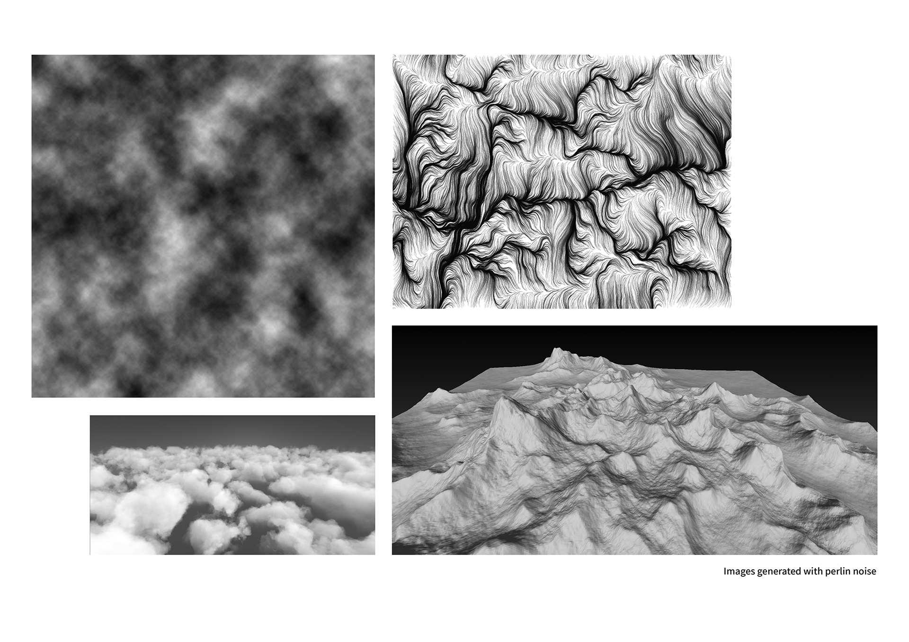
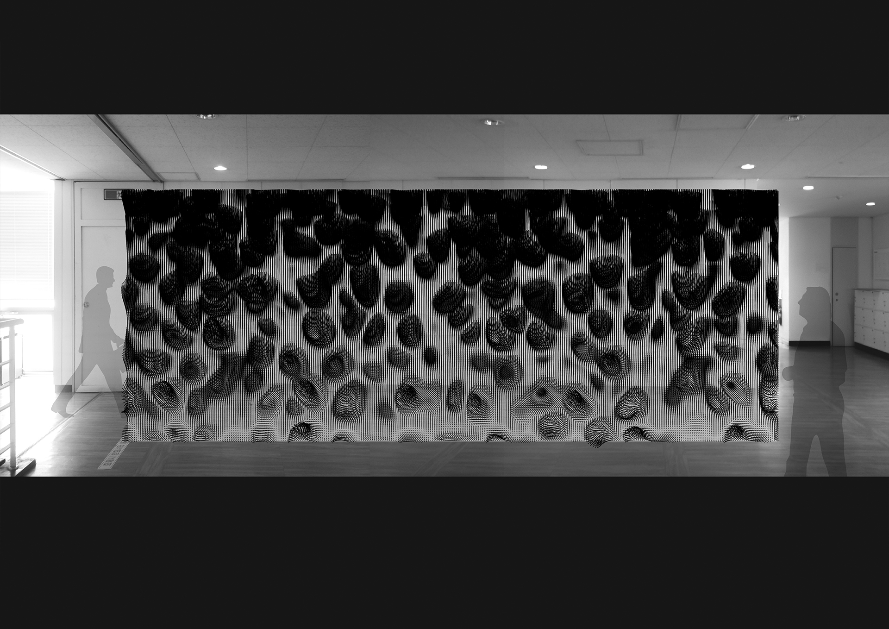
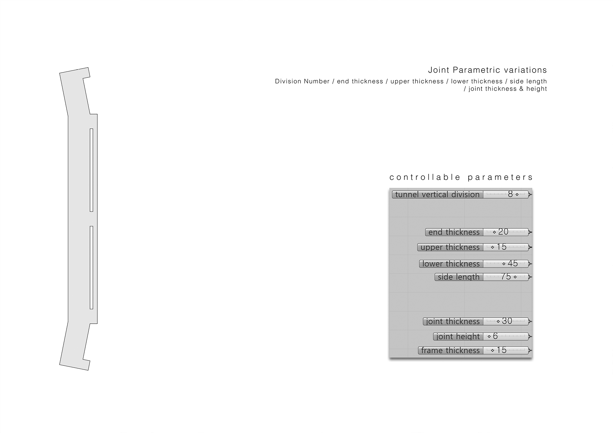

[:material-arrow-left-bold: project list](../../index.md){ .md-button }  
 

>date: 2015, 2nd semester  
>course: (Architecture major) Digital Design Studio  
>team: 이건일, 이학, 최슬온, 최윤하  
>role: designed pavilion, provided fabrication method and profile for CNC machine, participated in the fabrication process  
>interval: 1/3 semester (final)  

## Contents
{width=800}
{width=800}
{width=800}
{width=800}
{width=800}
{width=800}
{width=800}
{width=800}

!!! danger "UNDER CONSTRUCTION"
    This page is under construction.

[:material-arrow-left-bold: project list](../../index.md){ .md-button }