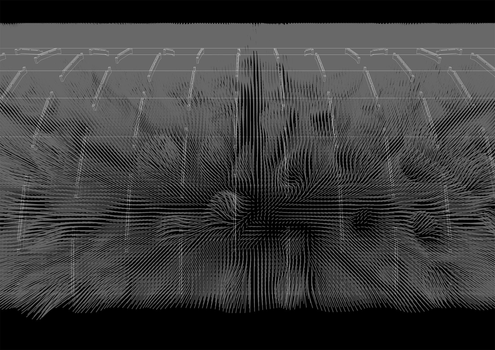
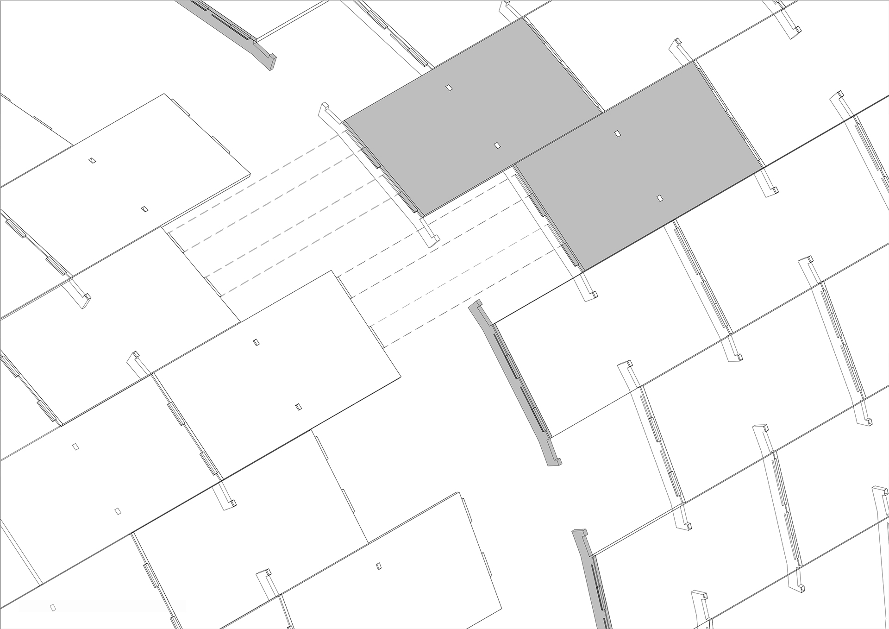
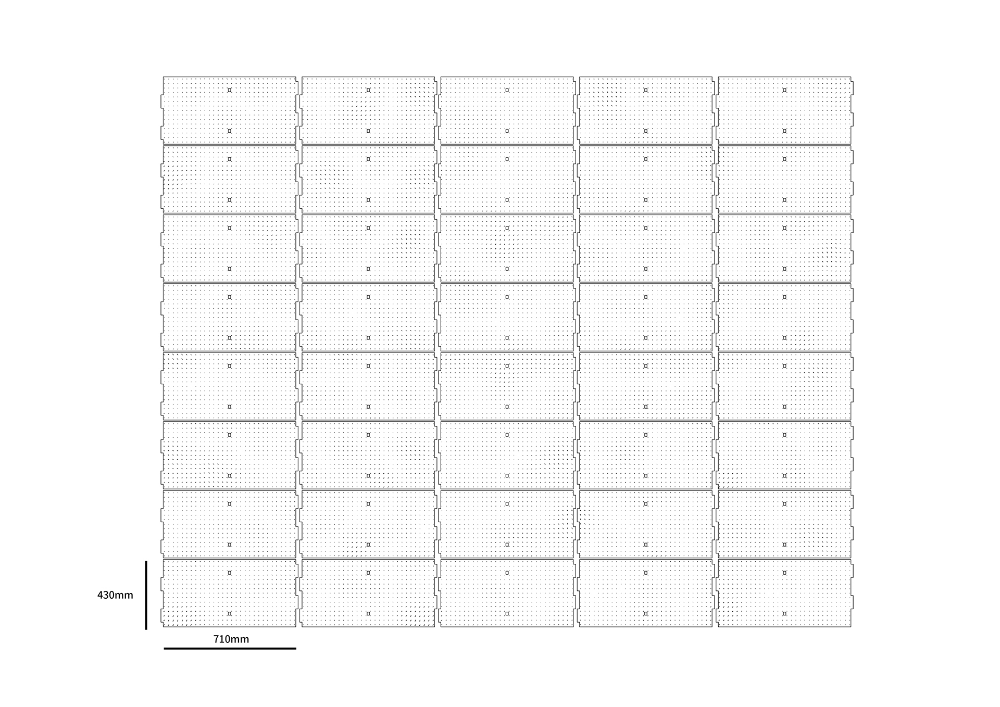
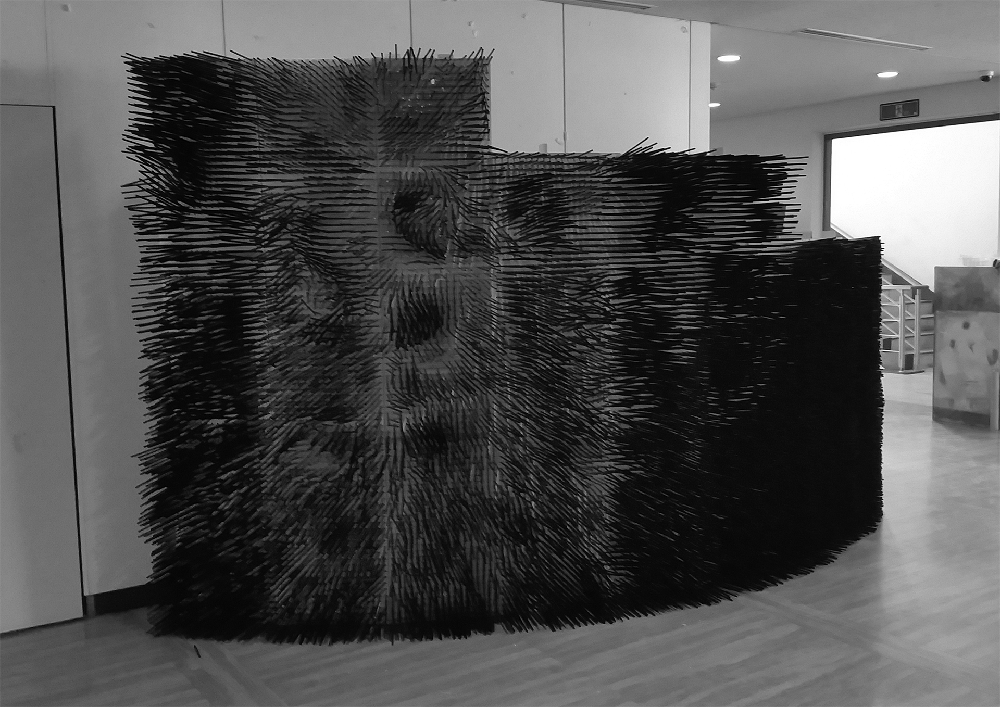
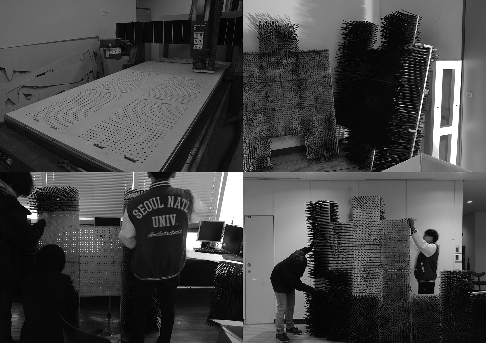

[:material-arrow-left-bold: 프로젝트 목록](../../index.md){ .md-button }  
 

>날짜: 2015, 2학기  
>수업: (건축학과) 디지털 디자인 스튜디오  
>팀원: 이건일, 이학, 최슬온, 최윤하  
>역할: 파빌리온 디자인, 제작 방법 설계, 제작 과정 참여  
>기간: 1/3학기 (기말 프로젝트)  

## Contents
{width=800}
{width=800}
{width=800}
<iframe width="800" height="450" src="https://www.youtube.com/embed/XyitF9K2YdU?si=ipzEFQcMm2qCzjj8" title="YouTube video player" frameborder="0" allow="accelerometer; autoplay; clipboard-write; encrypted-media; gyroscope; picture-in-picture; web-share" referrerpolicy="strict-origin-when-cross-origin" allowfullscreen></iframe>

{width=800}
{width=800}
{width=800}
{width=800}
{width=800}
<iframe width="800" height="450" src="https://www.youtube.com/embed/9gbYmTk9yAM?si=MRUMv7lK7S7VqW56" title="YouTube video player" frameborder="0" allow="accelerometer; autoplay; clipboard-write; encrypted-media; gyroscope; picture-in-picture; web-share" referrerpolicy="strict-origin-when-cross-origin" allowfullscreen></iframe>

!!! danger "UNDER CONSTRUCTION"
    This page is under construction.

[:material-arrow-left-bold: 프로젝트 목록](../../index.md){ .md-button }