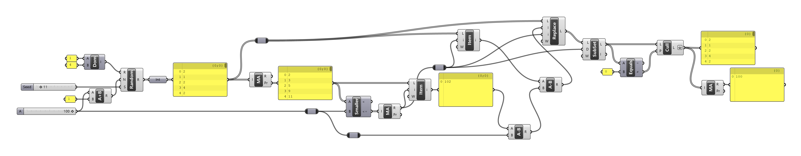

[:material-arrow-left-bold: Back to post list](../index.md){ .md-button }

`2024. 07. 27.`

Knowing about Voronoi and genetic algorithms but not knowing about for loops? While this might sound absurd to developers, quite a few people who have only used Grasshopper while studying architecture are in exactly this state. The reasons for this are as follows:

- What Grasshopper supports:
    - Creating Voronoi diagrams using outlines and points (Voronoi component)
    - Running genetic algorithms using certain values as parameters and a specific value as fitness (Galapagos component)
- What Grasshopper doesn't support:
    - Directly utilizing loops like for and while loops. It's not impossible, but you need to use components that allow direct code writing or install additional components.

If you want to know how inconvenient it is not to be able to use for loops, you can try to solve the following problem using Grasshopper:

!!! question
    There are a total of 100 candies, and you want to create several pouches, each containing 1 to 4 candies. When trying to use all the candies, output a list showing how many candies are in each pouch. Note that changing the random seed should produce different results.

If a person were to perform the above task directly, it would be natural to follow this procedure:

1. Pick 1 to 4 candies from the candy pile and put them in a pouch.
2. Repeat this process until there are no candies left in the pile.
3. Once the candy pile is gone, list out the number of candies in each pouch.

When written as Python code, it results in something like the following. Looking at the code content alone, we can see that it quite intuitively translates the above procedure.
```python
import random

# init
r = 1
random.seed(r)
result_list = []
my_candies = 100

while my_candies > 0:
    # Pick a number to add to the list.
    # In this case, take the smaller of these two numbers:
    # - A random integer between 1 and 4
    # - The number of remaining candies in the pile
    #
    # For example, if there are 2 candies left and the randomly selected number is:
    # - 1: Take this. Then 1 candy will be left in the pile, and the loop continues.
    # - 2: Take this. Then 0 candies will be left, and the loop ends.
    # - 3 or 4: These can't be used as there are only 2 candies left. So instead of 3 or 4,
    #   take 2 (the number of remaining candies). Then 0 candies will be left, and the loop ends.
    i = min(my_candies, random.randint(1, 4))

    # Add the generated number to the result list.
    # But is there a case where 0 could be added to the list?
    # - The randomly selected integer only comes from 1 to 4, so i becomes 0 only when there are no candies left.
    # - However, when there are no candies left, it doesn't pass the while loop condition.
    result_list.append(i)

    # Subtract the number of candies added to the list, that is, the number of candies 
    # put in the new compartment, from the remaining candies.
    my_candies -= i

print(result_list, sum(result_list))
```

But how would we approach this in Grasshopper? I came up with the following method:

1. Prepare 101 pouches to put candies in. Since we need 100 pouches if we put only one candy in each pouch, it's guaranteed that we won't need more than 100 pouches in any case, but we prepare one extra for the following process.
2. Plan to randomly put 1-4 candies in each pouch. In simple terms, generate 101 random integers with values 1-4. These integers can be considered as the number of candies to be put in the 0th, 1st, ..., 100th pouch.
3. Calculate the sum of candies to be put in pouches from 0th to nth. This sum should be calculated for all n satisfying 0<=n<101. This can be directly obtained through the partial results of Grasshopper's mass addition component.
4. Compare each result of the above partial results to see if it's less than or equal to 100, obtain 100 true/false results, and mass add these. The value i obtained this way becomes the index value of the first partial result that exceeds 100. If the value i obtained by mass addition is 43, it means the sum of candies in pouches 0 to 42 is less than 100, and the sum of candies in pouches 0 to 43 is 100 or more.
5. The number of candies in the ith pouch needs to be adjusted so that the sum of candies in pouches 0, 1, ..., i is exactly 100. Therefore, calculate the value v by subtracting 100 from the sum of candies in pouches 0 to i (the ith partial result from step 3), and subtract this value from the ith pouch. For example, when the sum of candies in pouches 0 to 43 is 102, we need to remove 2 candies from the 43rd pouch. Is it guaranteed that this will always work as desired? I hope readers will think about this themselves :)
6. Since we only need pouches 0 to i out of pouches 0 to 100, create a new list by extracting only the values of pouches between 0 and i. Use Grasshopper's subset component for this.
7. There may be cases where the ith pouch is 0, but according to the context of the problem, there can't be a pouch with 0 candies, so it should be removed. Check if the number of candies in each pouch from the result of step 6 is equal to 0, then find and remove the ones that are 0. Use the equal and cull pattern components for this.
8. List the results that came out after going through the above process.

[{width=800}](../../../../assets/tools-and-tales/thoughts/2024/gh-candies.png){:target="_blank"}  

The procedure is long and complex. It's to the point where you might wonder if this was really such a difficult task. Moreover, it's very unintuitive compared to the method explained at the beginning. Both the mass addition component mentioned above and the component that runs the genetic algorithm are clearly using loops internally, but this concept is not exposed to users. So Grasshopper users may be familiar with data being processed and flowing in one direction, but they may find it difficult to intuitively understand processing data in a list one by one while continuously updating a specific variable, or stopping processing when a certain condition is met.

In my opinion, this loop is the very concept that architects who have only studied up to Grasshopper should understand first when they want to study development. As you can see from the previous Python code, for loops are essential to solve the same problem more intuitively, and in a shorter and simpler way. Moreover, since this loop is used as almost a basic of basics in studying development afterwards, it's necessary to properly understand what can be done with loops and how they can be utilized.

[:material-arrow-left-bold: Back to post list](../index.md){ .md-button }