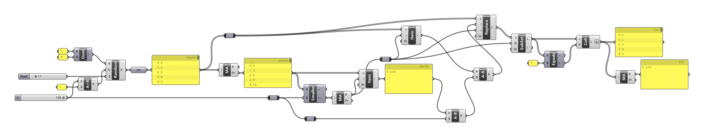

[:material-arrow-left-bold: 글 목록](../index.md){ .md-button }

`2024. 07. 27.`

보로노이랑 유전알고리즘은 아는데 for문을 모른다? 개발자들이 들으면 정말 황당한 이야기겠지만, 건축을 공부하면서 그래스호퍼만 써본 꽤 많은 사람들이 딱 이런 상태다. 이렇게 된 이유는 다음과 같다.

- 그래스호퍼가 지원해주는 것:
    - 외곽선과 점들을 가지고 voronoi 다이어그램 만들기 (voronoi 컴포넌트)
    - 몇몇 값들을 파라메터로 쓰고 특정 값을 fitness로 하여 유전 알고리즘 돌리기 (galapagos 컴포넌트)
- 그래스호퍼가 지원해주지 않는 것:
    - for, while문과 같은 루프를 직접 활용하기. 방법이 없지는 않지만, 직접 코드를 작성할 수 있는 컴포넌트를 활용하거나 추가적인 컴포넌트를 설치해야 한다.

for문을 쓸 수 없는 것이 얼마나 불편한지 알고싶다면, 아래의 문제를 그래스호퍼를 이용해서 풀어보려고 시도해보면 된다.

!!! question
    사탕이 총 100개가 있고, 사탕을 1~4개씩 넣은 주머니를 여럿 만들고자 한다. 모든 사탕을 다 쓰려고 할때, 주머니에 사탕이 몇 개씩 들어있는지 나열한 결과를 출력되게 하시오. 단, 랜덤 시드를 바꾸면 다른 결과가 나와야 한다.

사람이 직접 위의 작업을 수행하고자 한다면 다음과 같은 절차를 따르는 것이 자연스러울 것이다.

1. 사탕 더미에서 사탕을 1~4개를 골라 주머니에 넣는다.
2. 이 작업을 사탕 더미에 사탕이 다 없어질 때까지 반복한다.
3. 사탕 더미가 없어졌으면 주머니에 있는 사탕 개수를 쭉 나열한다.

이를 파이썬 코드로 작성하면 아래와 같은 결과가 나온다. 코드 내용만 보면 위의 절차를 꽤 직관적으로 옮겨놓았음을 확인할 수 있다.
```python
import random

# 초기화
r = 1
random.seed(r)
result_list = []
my_candies = 100

while my_candies > 0:
    # 리스트에 추가할 숫자를 정한다.
    # 이때, 다음의 두 숫자 중에 작은 수를 취한다.
    # - 1~4 사이의 랜덤한 정수
    # - 남은 사탕 개수
    #
    # 예를 들어 남은 사탕이 2개인데 랜덤하게 선택한 숫자가
    # - 1이 나오면 이걸 취하면 된다. 그럼 남은 사탕이 1개가 되고, 루프를 한 번 더 돈다.
    # - 2가 나오면 이걸 취하면 된다. 그럼 남은 사탕이 0개가 되고, 루프를 벗어난다.
    # - 3, 4가 나와도 남은 사탕이 2개밖에 없으므로 이 숫자를 쓸 수 없다. 그러므로 3, 4 대신
    #   남은 사탕 개수인 2를 취하면 남은 사탕이 0개가 되고, 루프를 벗어난다.
    i = min(my_candies, random.randint(1, 4))

    # 생성한 숫자를 결과 리스트에 추가한다.
    # 그런데 리스트에 0이 들어갈 경우는 없는가?
    # - 랜덤하게 선택한 정수는 1~4 안에서만 나오므로 남은 사탕이 0인 경우에만 i가 0이 된다.
    # - 그런데 남은 사탕이 0인 경우 while문의 조건을 통과하지 못하므로, 이런 상황은 나오지 않는다.
    result_list.append(i)

    # 리스트에 추가한, 즉, 새로운 칸에 넣은 사탕의 개수만큼 남은 사탕에서 빼준다.
    my_candies -= i

print(result_list, sum(result_list))
```

그런데 이걸 그래스호퍼로는 어떻게 접근할까? 나는 아래와 같은 방법을 떠올렸다.

1. 사탕을 넣을 주머니 101개를 준비한다. 모든 주머니에 사탕을 1개만 넣을 경우 주머니가 100개가 필요하므로, 어떤 경우에도 주머니가 100개 넘게 필요하지 않은 것이 보장되지만, 이후 과정을 위해 1개 더 넉넉하게 준비한다.
2. 주머니에 사탕을 1~4개를 랜덤하게 넣을 것을 계획을 세운다. 쉽게 말하면, 1~4 값을 가진 랜덤한 정수 101개를 생성한다. 이 정수들은 각각 0번째, 1번째, ..., 100번째 주머니에 들어갈 사탕의 개수라고 보면 된다.
3. 0번~n번째 주머니에 들어갈 사탕 개수의 합을 구한다. 이때 0<=n<101을 만족하는 모든 n에 대해 이 합을 구해야 한다. 이는 그래스호퍼의 mass addition 컴포넌트의 partial results를 통해서 바로 얻을 수 있다.
4. 위의 partial results의 각각의 결과값에 대해 100 이하인지 비교하여 100개의 true/false 결과를 얻고, 이를 mass addition한다. 이렇게 얻은 값 i는 최초로 100을 넘긴 partial result의 인덱스 값이 된다. mass addition으로 얻은 값 i가 43이라고 하면, 0번~42번 주머니에 있는 사탕 개수의 합은 100 미만이고, 0번~43번 주머니에 있는 사탕 개수의 합은 100 이상이라는 말이다.
5. i번째 주머니에 들어간 사탕의 개수를 조절해주어야 0, 1, ..., i번째 주머니의 사탕의 개수를 전부 더했을때 딱 100이 된다. 그러므로 0번~i번째 주머니에 들어간 사탕 개수의 합(3번의 결과에서 i번째 partial results)에서 100을 뺀 값 v를 구하고, 이 값을 i번째 주머니에서 뺀다. 예를 들어, 0번~43번 주머니에 있는 사탕 개수의 합이 102일때, 43번째 주머니에 들어있는 사탕에서 2개를 빼주어야 한다. 이게 항상 원하는 대로 작동할 것이 보장되는가? 이는 독자들이 직접 생각해보길 바란다 :)
6. 0번~100번의 주머니 중 0번~i번째 주머니만 필요하므로, 0~i 사이의 주머니 값만 따로 빼서 새로운 리스트를 만든다. 이때 그래스호퍼의 subset 컴포넌트를 사용한다.
7. i번째 주머니가 0인 경우가 발생할 수 있는데, 문제의 맥락에 따르면 사탕이 0개만 들어간 주머니는 있을 수 없으니 제거해주어야 한다. 6번의 결과물에서 모든 주머니의 사탕 개수와 0이 같은지 확인한 뒤, 0인 것만 찾아서 제거한다. 이때 equal과 cull pattern 컴포넌트를 사용한다.
8. 위의 과정을 거치고 나온 결과를 나열한다.

[{width=800}](../../../../assets/tools-and-tales/thoughts/2024/gh-candies.png){:target="_blank"}  

절차가 길고 복잡하다. 도대체 이게 이렇게 어려운 일이었나 싶을 정도다. 게다가 처음에 설명한 방법에 비해 매우 비직관적이다. 위의 mass addition 컴포넌트도 그렇고 유전 알고리즘을 돌려주는 컴포넌트도 그렇고 내부적으로는 loop를 사용하고 있을 것이 분명하지만, 이 개념이 유저들에게 노출되어있지는 않다. 그래서 그래스호퍼 유저들은 데이터가 한 방향으로 처리되면서 흘러가는 것에는 익숙해도, 리스트 안에 있는 데이터를 하나씩 처리하면서 특정 변수를 계속 업데이트 하거나, 특정 조건을 만족하면 처리를 멈추는 것을 직관적으로 이해하기 어려울 수 있다.

내가 생각하기에 그래스호퍼까지만 공부해본 건축가들이 개발을 공부하고 싶을때 제일 먼저 이해해야 하는 개념이 바로 이 loop다. 앞선 파이썬 코드를 보면 알겠지만, 같은 문제를 좀 더 직관적으로, 그리고 짧고 간단하게 풀기 위해서 for문이 필수다. 게다가 이 loop는 이후 개발을 공부하는 데에 있어 거의 기초 중의 기초 수준으로 많이 쓰이는 개념이기 때문에 loop로 무얼 할 수 있는지, 어떤 용도로 활용할 수 있는지 제대로 이해할 필요가 있다.

[:material-arrow-left-bold: 글 목록](../index.md){ .md-button }