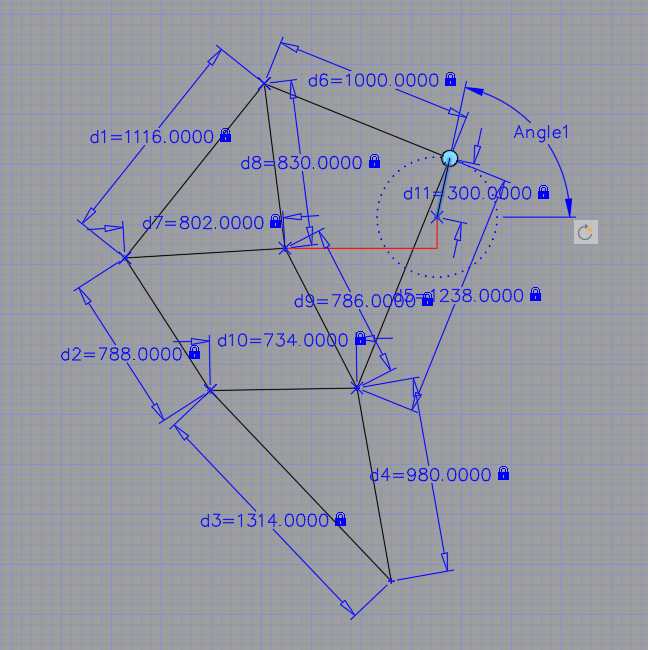
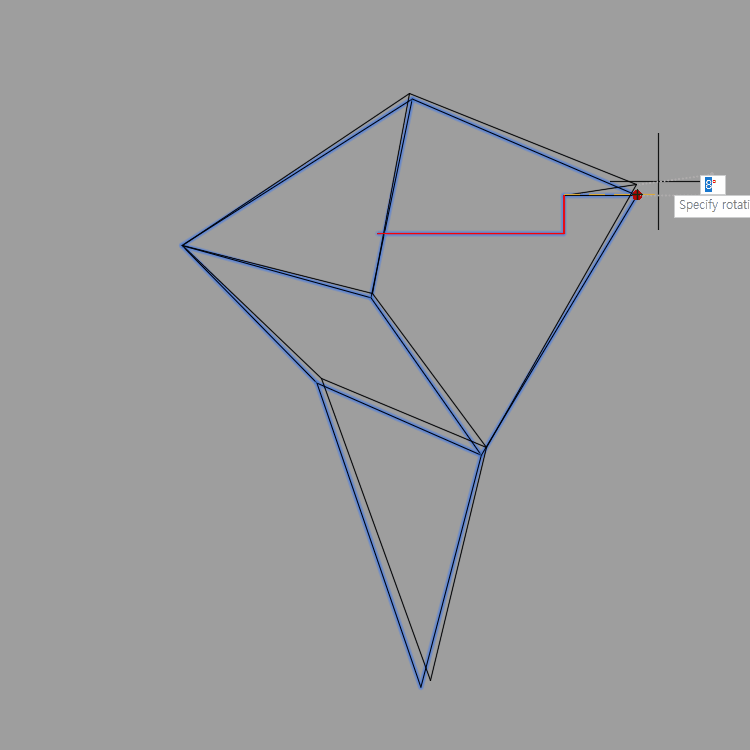

[:material-arrow-left-bold: project list](../index.md){ .md-button }  

I made Jansen linkage^1)^ with constraints^2)^.

{width=600}
{width=600}

-----
1) [Jansen's linkage - Wikipedia](https://en.wikipedia.org/wiki/Jansen%27s_linkage)  
2) [AutoCAD 2025 Help | About Adding Constraints to Dynamic Blocks | Autodesk](https://help.autodesk.com/view/ACD/2025/ENU/?guid=GUID-9D8EFCA5-916F-43EB-9343-C49BAF2FB633)

[:material-arrow-left-bold: project list](../index.md){ .md-button }  